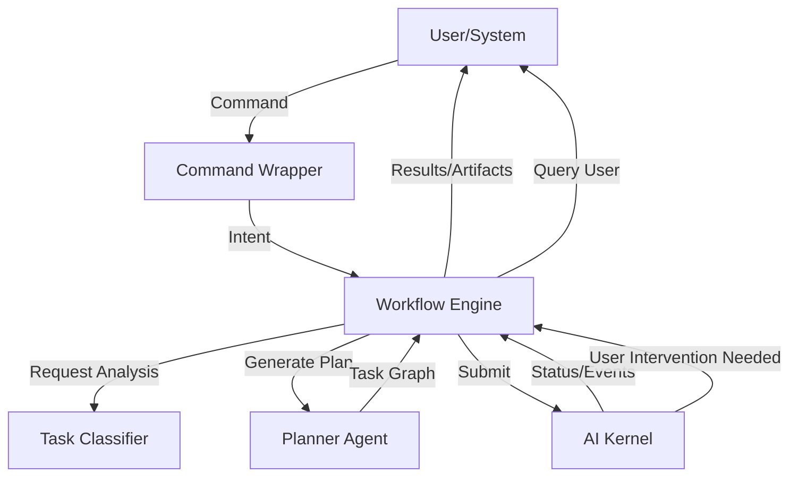

# Automation Architecture

The Automation Layer serves as the primary interface between the user and the PEN.GUIN AI system. It is responsible for capturing user intent, translating high-level commands into actionable task graphs, and orchestrating the communication between the user and the AI Kernel.

## Workflow Overview

The flow of information through the Automation Layer follows a structured path from command to completion.

### 1. Command Entry
User commands enter the system through various channels:
- **CLI (Gemini CLI)**: Direct textual commands and flags provided by the user.
- **REST/WebSocket API**: Integration points for external IDEs, dashboards, or CI/CD pipelines.
- **Hook Events**: Automated triggers from external systems (e.g., a GitHub webhook or a system monitoring alert).

### 2. Command Translation (Taskification)
Once a command is received, the `Workflow Engine` and `Task Classifier` work together to translate it into a structured execution plan.
- **Intent Analysis**: The system uses LLM-based parsing to understand the objective, scope, and constraints of the user's request.
- **Plan Generation**: The `Planner Agent` breaks down the intent into a series of discrete, interdependent tasks.
- **Taskification**: Each step is converted into a standard task node in the graph, as defined in `core/task-node.md`.

### 3. Kernel Interaction
The Automation Layer hands off the generated plan to the AI Kernel for execution.
- **Submission**: The `Workflow Engine` submits the task graph to the `Execution Engine`.
- **Status Monitoring**: The Automation Layer subscribes to events from the `Execution Logs` to track progress in real-time.
- **Intervention Requests**: If the Kernel encounters a `blocked` task that requires user input, the Automation Layer manages the asynchronous request/response cycle.

### 4. Result Delivery
Upon completion or failure of the task graph, the Automation Layer returns the results to the user.
- **Artifact Presentation**: The system summarizes the artifacts generated (e.g., "Generated 3 components, 1 API route").
- **Final Synthesis**: An agent (often the `Documentation Agent` or `Review Agent`) provides a high-level summary of what was achieved.
- **Feedback Loop**: The user is presented with the final state and prompted for feedback or follow-up commands, which are then fed back into the `Learning Engine`.

## System Components

- **Workflow Engine (`automation/workflow-engine.md`)**: The central orchestrator for high-level command-to-completion cycles.
- **Task Classifier (`routing/task-classifier.md`)**: Identifies the type and complexity of the incoming request.
- **Task Queue (`automation/task-queue.md`)**: Manages the buffer of incoming requests and ensures they are processed in order.
- **Task Runtime (`automation/task-runtime.md`)**: Handles the specific environment setup needed for command translation.

