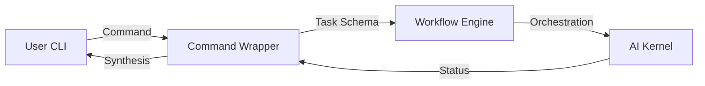

# Command System

The `PEN.GUIN` CLI provides a high-level command interface for interacting with the AI ecosystem. These commands encapsulate complex workflows, automatically orchestrating the planner, scheduler, and kernel to achieve user objectives.

## Command Definitions and Task Mappings

### 1. `penguin run task`
Executes a single, isolated task.
- **Purpose**: Ideal for specific, well-defined actions where a full project plan isn't necessary.
- **Workflow**:
    1.  **Taskification**: Directly creates a single `Task Node`.
    2.  **Kernel Submission**: Skips the multi-step planning phase and sends the task directly to the `Execution Engine`.
    3.  **Result**: Returns the output artifact and logs for that specific task.

### 2. `penguin build feature`
Constructs a complete feature from a high-level description.
- **Purpose**: The primary command for feature development, handling everything from architectural design to implementation.
- **Workflow**:
    1.  **Planning**: Triggers the `Planner Agent` to generate a multi-node `Task Graph`.
    2.  **Architecture**: Maps initial tasks to the `Architecture Agent` for design and contracts.
    3.  **Implementation**: Maps subsequent tasks to `Backend` and `Frontend` agents.
    4.  **Verification**: Automatically appends a `review code` task at the end of the graph.

### 3. `penguin review code`
Performs a comprehensive review of the current workspace or specific files.
- **Purpose**: Ensures code quality, adherence to `AI_ENGINEERING_RULES.md`, and security.
- **Workflow**:
    1.  **Scope Identification**: Identifies modified or target files.
    2.  **Audit Task**: Dispatches a task to the `Review Agent` for quality analysis.
    3.  **Security Task**: Dispatches a parallel task to the `Security Agent` for vulnerability scanning.
    4.  **Synthesis**: Combines the results into a single `Review Report` artifact.

### 4. `penguin generate docs`
Synchronizes documentation with the current state of the codebase.
- **Purpose**: Keeps technical debt low and ensures the system remains observable.
- **Workflow**:
    1.  **Analysis**: Triggers a `Repository Inspector` task to map current exports and logic.
    2.  **Documentation Task**: Dispatches tasks to the `Documentation Agent` to update or create relevant `.md` files.
    3.  **Validation**: Ensures that all public APIs documented in contracts are reflected in the final docs.

### 5. `penguin analyze project`
Provides an architectural and health overview of the project.
- **Purpose**: Helps the user (and agents) understand complex system dependencies and technical debt.
- **Workflow**:
    1.  **Inspection**: Triggers deep analysis tasks across the entire codebase.
    2.  **Metric Collection**: Gathers data on test coverage, cyclomatic complexity, and dependency health.
    3.  **Reporting**: Generates a comprehensive architectural overview artifact.

## Command-to-Task Mapping Summary

| Command | Internal Trigger | Primary Agents | Final Artifact |
| :--- | :--- | :--- | :--- |
| `run task` | Execution Engine | Assigned Specialist | Task Result / Logs |
| `build feature` | Planner Agent | Architect, Backend, Frontend | Functional Code + Docs |
| `review code` | Review Agent | Reviewer, Security | Review Report |
| `generate docs` | Documentation Agent | Documentation, Inspector | Updated .md Files |
| `analyze project` | Architecture Agent | Architect, Inspector | System Analysis Report |

