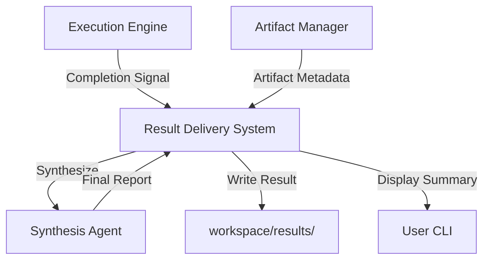

# Result Delivery System

The Result Delivery System is the final stage of the PEN.GUIN workflow. It is responsible for aggregating, formatting, and presenting the outputs generated by agents to the user in a clear and actionable manner.

## Core Responsibilities

The Result Delivery System performs the following tasks:

### 1. Synthesis of Outcomes
After the `Execution Engine` completes a task graph, the `Result Delivery System` synthesizes the various artifacts into a final report.
- **Aggregation**: It gathers all relevant artifacts (code, docs, analysis) linked to the user's initial command.
- **Summarization**: An agent (typically the `Review Agent` or `Documentation Agent`) generates a high-level summary of the work performed, highlighting key changes and any remaining actions.

### 2. Standardized Storage
Every command execution results in a structured `Result File` stored in the `workspace/results/` directory. This ensures that the user has a persistent record of the outcome.

- **Directory Path**: `workspace/results/`
- **Naming Convention**: `result-<session_id>.json` or `result-<timestamp>.md`

### 3. Formatting and Presentation
Results are formatted to be easily consumable by humans and machines:

- **JSON Summary**: A machine-readable file containing the session metadata, status (Success/Failure), and links to all generated artifacts.
- **Markdown Report**: A human-readable synthesis including:
    - **Objective Status**: Whether the goal was fully or partially met.
    - **Artifact Manifest**: A list of all files created or modified.
    - **Execution Metrics**: Time taken, number of tasks executed, and agents involved.
    - **Next Steps**: Suggestions for follow-up actions or verification.

### 4. Delivery Channels
The system supports multiple ways to deliver the final result:

- **CLI Output**: A concise summary printed directly to the terminal using `Gemini CLI`.
- **File System**: The full Markdown report and JSON summary are saved to `workspace/results/`.
- **API/Hook Notifications**: For automated workflows, a payload is sent to configured endpoints or triggers.

## Workflow Integration

1.  **Completion**: The `Execution Engine` signals that all tasks in the graph have reached a terminal state.
2.  **Aggregation**: The `Artifact Manager` provides a list of all artifacts associated with the current `session_id`.
3.  **Synthesis**: The `Result Delivery System` invokes a specialized agent to generate the final report.
4.  **Persistence**: The system writes the result file to `workspace/results/`.
5.  **Presentation**: The final summary is displayed to the user via the CLI.

