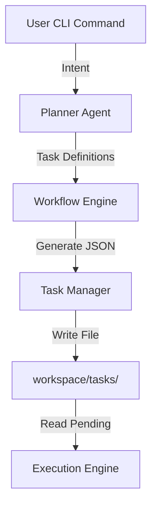

# Task Ingestion System

The Task Ingestion System is the entry point for all work within the PEN.GUIN ecosystem. it is responsible for capturing user intent from the CLI and translating it into structured, executable Task Nodes stored in the workspace.

## Ingestion Process

When a user executes a command (e.g., `penguin build feature "user authentication"`), the system follows these steps:

### 1. Command Capture
The `Command System` receives the high-level request. It identifies the command type and the raw user input (the "objective").

### 2. Intent Parsing and Planning
The `Planner Agent` analyzes the objective.
- **Decomposition**: It breaks the high-level goal into smaller, atomic units of work.
- **Dependency Mapping**: It identifies which tasks must be completed before others (e.g., API must exist before the Frontend can consume it).
- **Agent/Skill Mapping**: It identifies the required skills and target agent types for each task.

### 3. Task Node Generation (Taskification)
For each identified unit of work, the `Workflow Engine` generates a JSON file following the `core/task-node.md` specification.
- **UUID Assignment**: Each task is given a unique `task_id`.
- **Instruction Synthesis**: The planner generates a specific `instruction` (prompt) for the agent that will handle the task.
- **Artifact Definition**: The planner defines the expected `input_artifacts` and `output_artifacts`.

### 4. Storage and Queueing
The generated JSON files are written to the `workspace/tasks/` directory.
- **Initial State**: Most tasks start in the `blocked` state if they have dependencies, or `pending` if they are ready for immediate execution.
- **File Naming**: Task files are named using their `task_id` (e.g., `task-8f2b-4c1a.json`) to ensure unique and predictable paths.

## Task File Structure

Task files are the source of truth for an agent's work. They must conform to the JSON schema defined in `core/task-node.md`.

### Example Task File (`workspace/tasks/task-auth-001.json`)

```json
{
  "task_id": "task-auth-001",
  "objective": "Create the User Authentication API contract",
  "execution_status": "pending",
  
  "routing_metadata": {
    "assigned_agent": null,
    "competency_tags": ["backend", "api-design"],
    "required_skills": ["schema-generator"]
  },

  "graph_metadata": {
    "dependencies": [],
    "dependents": ["task-auth-002"]
  },

  "payload": {
    "instruction": "Design a RESTful API contract for user login and registration using JSON Schema.",
    "input_artifacts": [],
    "output_artifacts": [
      {
        "type": "schema",
        "expected_path": "workspace/artifacts/auth-contract.json",
        "validation_criteria": "Must include email, password, and JWT response fields."
      }
    ]
  },
  
  "execution_log": {
    "session_id": null,
    "started_at": null,
    "completed_at": null,
    "error_trace": null
  }
}
```

## System Integration

- **Workflow Engine**: Manages the creation and updates of task files.
- **Planner Agent**: Provides the logic for breaking down commands into tasks.
- **Execution Engine**: Monitors the `workspace/tasks/` directory for `pending` tasks to dispatch via the `Agent Runner`.


