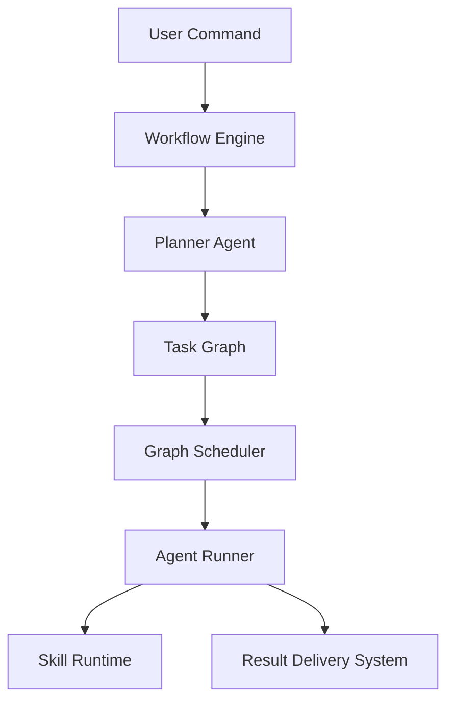

# Automation Workflows

Automation workflows in the PEN.GUIN ecosystem define the sequence of actions and the coordination of agents required to fulfill specific high-level user commands. These workflows transform abstract objectives into concrete results through a series of interdependent tasks.

## Core Workflows

The following workflows are the primary drivers of productivity within the system.

### 1. Feature Development Workflow
This is the most complex workflow, involving multiple agents and skills to build a functional feature from scratch.
- **Trigger**: `penguin build feature "<feature_description>"`
- **Steps**:
    1.  **Planning**: The `Planner Agent` breaks down the feature into architectural, backend, and frontend tasks.
    2.  **Design**: The `Architecture Agent` defines API contracts and data schemas.
    3.  **Backend Implementation**: The `Backend Agent` builds the server-side logic and database interactions.
    4.  **Frontend Implementation**: The `Frontend Agent` constructs the UI components and integrates with the backend APIs.
    5.  **Quality Assurance**: The `Review Agent` performs a final code audit before completion.

### 2. Code Review Workflow
Automates the evaluation of recent code changes to maintain high standards of quality and security.
- **Trigger**: `penguin review code` or an automated CI/CD hook.
- **Steps**:
    1.  **Change Detection**: The `Repository Inspector` identifies files modified since the last stable state.
    2.  **Linting & Style**: The `Review Agent` checks for idiomatic code and adherence to style guides.
    3.  **Security Audit**: The `Security Agent` scans for vulnerabilities (e.g., secrets in code, injection points).
    4.  **Reporting**: A consolidated `Review Report` is generated and delivered to the user.

### 3. Documentation Generation Workflow
Ensures that technical documentation remains synchronized with the evolving codebase.
- **Trigger**: `penguin generate docs`
- **Steps**:
    1.  **Codebase Scanning**: The `Repository Inspector` parses the code to identify public APIs, exported symbols, and structural changes.
    2.  **Synthesis**: The `Documentation Agent` updates existing `.md` files or creates new ones based on the scan results.
    3.  **Cross-Reference Validation**: The agent ensures that documentation matches the current implementation and API contracts.

### 4. Project Analysis Workflow
Provides a high-level view of project health, architecture, and technical debt.
- **Trigger**: `penguin analyze project`
- **Steps**:
    1.  **Deep Inspection**: Triggers extensive scans for dependency health, cyclomatic complexity, and test coverage.
    2.  **Architectural Mapping**: The `Architecture Agent` visualizes the system's current structure and identifies potential bottlenecks.
    3.  **Health Assessment**: Aggregates metrics into an `Architectural Overview` report.

## Triggering Agents and Skills

Workflows act as the "director" for agents and skills, ensuring they are utilized at the right moment.

### Agent Triggering
- **Role Assignment**: Based on the task definition in the graph, the `Graph Scheduler` selects the appropriate agent (e.g., `frontend-agent` for UI tasks).
- **Instruction Injection**: The `Agent Runner` injects specific prompts from `workspace/prompts.md` and the task-specific `objective` into the agent's session.

### Skill Activation
- **Dynamic Loading**: During a task's execution, the `Skill Runtime` detects if a specialized capability (e.g., `schema-generator` or `unit-test-builder`) is needed.
- **Runtime Integration**: If a skill is required, its instructions are appended to the agent's prompt, and any necessary tools are provisioned to the execution environment.
- **Skill Chaining**: Workflows often define "chains" where the output of one skill (e.g., a generated API spec) is immediately used as the input for another (e.g., generating client-side types).

