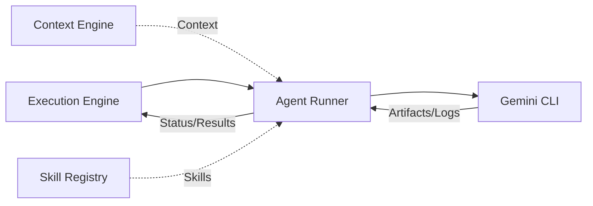

# Agent Runner

The Agent Runner is the component within the PEN.GUIN Execution Engine responsible for the instantiation, execution, and monitoring of individual AI agents. It serves as the bridge between the high-level task orchestration and the low-level execution environment provided by the Gemini CLI.

## Launching Agents with Gemini CLI

The Runner utilizes the Gemini CLI as its primary execution environment. When the Execution Engine dispatches a task, the Runner:
1.  **Invokes the CLI**: Starts a new Gemini CLI session with specific environment flags and configurations.
2.  **Identifies the Agent Role**: Passes the appropriate initialization prompt from `workspace/prompts.md` (e.g., Architecture, Frontend, or Backend) to set the agent's persona and guardrails.
3.  **Monitors Output**: Captures the CLI's standard output, error streams, and tool-call events to track progress and handle errors.

## Task and Context Handoff

### Task Reception
An agent receives its specific task through a dynamically constructed **Task Prompt**. This prompt explicitly defines the goal, the target files, and any specific constraints for the current unit of work.

### Execution Context Provision
The `Context Engine` synthesizes a rich context object that the Agent Runner injects into the CLI session. This context includes:
- **Workspace State**: Relevant file paths, directory structures, and recent changes.
- **API Contracts**: JSON schemas and interface definitions for cross-agent collaboration.
- **Shared Memory**: Key facts or preferences stored in `kernel/decision-memory.md` or global memory.

## Skill Loading and Integration

When the `Skill Detection` module identifies that a task requires specialized capabilities:
1.  **Loader Activation**: The Runner triggers the `tools/skill-loader.md` to fetch the skill's definition and instructions.
2.  **Instruction Injection**: The Runner appends the skill-specific procedural guidance (from the skill's `SKILL.md`) to the agent's active prompt.
3.  **Tool Provisioning**: If the skill requires specific tools, the Runner ensures they are accessible within the agent's execution sandbox.

## Result Reporting

Once an agent completes its task, the Runner manages the return of information to the Execution Engine:
- **Artifact Collection**: The Runner captures all files, code snippets, or documentation generated by the agent and stores them in `workspace/artifacts/`.
- **Status Signal**: The agent's final synthesis (e.g., `APPROVE`, `REJECT`, or a completion summary) is parsed by the Runner to update the task status in the graph to `completed`, `failed`, or `blocked`.
- **Context Preservation**: The Runner ensures that any important state changes or "lessons learned" during execution are passed back to the `Context Engine` for the next task in the graph.

