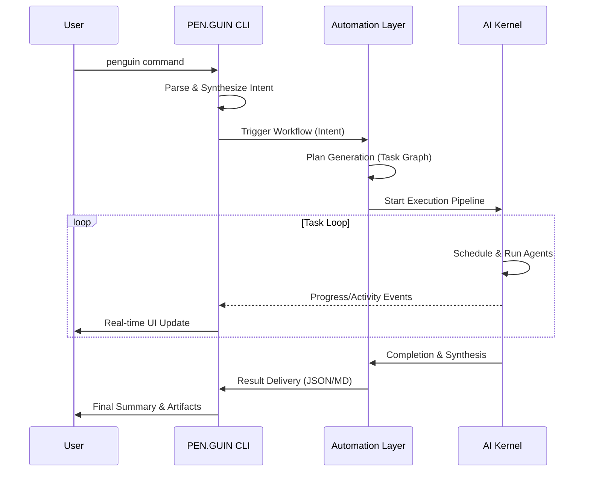

# CLI Runtime Integration

The CLI Runtime Integration is the bridge between the user's terminal and the internal PEN.GUIN automation and execution layers. It defines the sequential flow of events that occur from the moment a command is entered until the final results are delivered.

## Command Execution to Result Delivery Flow

The complete runtime lifecycle follows a strict sequence of operations:

### 1. Command Entry and Parsing
When the user executes a command (e.g., `penguin run "build user profile"`):
- **Command Parser**: The `core/command-parser.md` receives the raw string, extracts arguments and flags, and validates the syntax.
- **Intent Synthesis**: The CLI package the input into a "Command Intent" JSON.

### 2. Automation Layer Trigger
The CLI hands off the Command Intent to the `Automation Layer`:
- **Workflow Engine Activation**: The `Workflow Engine` (`automation/workflow-engine.md`) receives the intent and determines which high-level workflow to initiate (e.g., `feature development workflow`).
- **Plan Generation**: The `Planner Agent` is invoked to break the intent into a directed acyclic graph (DAG) of task nodes, which are stored in `workspace/tasks/`.

### 3. Execution Pipeline Initialization
Once the plan is generated, the `Execution Engine` (`core/execution-engine.md`) takes control:
- **Graph Loading**: The engine loads the task graph and transitions it to the `running` state.
- **Scheduler Interaction**: The `Graph Scheduler` (`kernel/task-scheduler.md`) identifies the first set of `ready` tasks based on dependencies and agent availability.

### 4. Agent Execution Loop
For each `ready` task:
- **Agent Runner Activation**: The `Agent Runner` (`core/agent-runner.md`) launches the assigned agent (e.g., `frontend-agent`) using the Gemini CLI.
- **Context Injection**: The `Context Engine` provides the necessary workspace context and skill instructions.
- **Skill Runtime**: If specialized skills are needed, the `Skill Runtime` (`skills/skill-runtime.md`) is integrated into the agent's session.
- **Artifact Generation**: The agent produces outputs (code, docs, logs) which are managed by the `Artifact Manager` (`workspace/artifact-manager.md`).

### 5. Monitoring and Feedback
Throughout the execution:
- **Logging**: Detailed logs are recorded in `workspace/execution-logs.md`.
- **CLI Output**: The `CLI Output System` (`core/cli-output.md`) provides real-time updates on task progress, agent activity, and execution status to the terminal.

### 6. Result Delivery
Upon completion of the task graph:
- **Result Synthesis**: The `Result Delivery System` (`automation/result-delivery.md`) aggregates the outcomes and generates a final `Result File` in `workspace/results/`.
- **Final Display**: The CLI presents the synthesis to the user, highlighting the achieved objectives and any follow-up actions.

