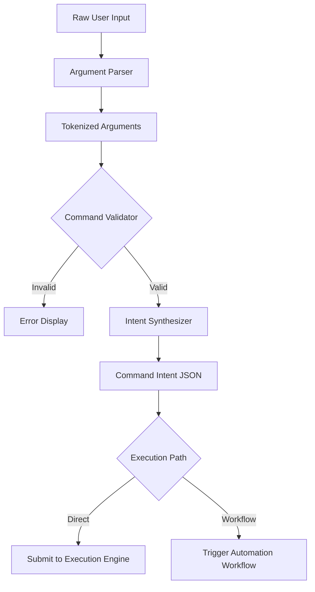

# Command Parser

The Command Parser is the component of the PEN.GUIN CLI responsible for interpreting user input and translating it into actionable internal requests. It ensures that commands are well-formed, authorized, and correctly mapped to the system's execution capabilities.

## Parsing Workflow

The parser follows a multi-stage process to convert raw terminal input into structured data.

### 1. Argument Parsing
The parser receives the raw command-line arguments (typically `process.argv` or equivalent).
- **Tokenization**: It splits the input into a sequence of tokens.
- **Flag Extraction**: Identifies and extracts options (e.g., `--force`, `-v`) and their associated values.
- **Positional Arguments**: Captures the main command, sub-commands, and target strings (e.g., the objective in `penguin run "build UI"`).
- **Schema Mapping**: Maps these tokens to a predefined schema that defines expected types and requirements for each command.

### 2. Command Validation
Before a command is processed, it must pass several validation checks:
- **Syntax Validation**: Ensures the command structure matches a valid pattern (e.g., `penguin run` must be followed by an objective).
- **Option Validation**: Checks that provided flags are supported for that specific command and that their values are in the correct format.
- **Context Validation**: Verifies that the command is appropriate for the current workspace state. For example, `penguin review` might fail if no files have been modified or if the environment is not initialized.
- **Conflict Detection**: Prevents the execution of commands that might conflict with currently running tasks or system states.

### 3. Task Generation (Taskification)
The final stage of the parser's work is the creation of an internal intent or task node.
- **Intent Synthesis**: The parser packages the validated arguments into a "Command Intent" JSON object.
- **Direct Task Mapping**: For simple commands like `penguin run <objective>`, the parser might directly generate a `Task Node` and submit it to the `Execution Engine`.
- **Workflow Triggering**: For complex commands like `penguin build feature`, the intent is sent to the `Automation Layer`'s `Workflow Engine`, which then triggers the `Planner Agent` to generate a full `Task Graph`.
- **Metadata Injection**: The parser appends relevant metadata to the intent, such as the `user_id`, `working_directory`, and a unique `request_id` for tracking.

## Integration with CLI and Automation



## Example Intent Format

```json
{
  "command": "run",
  "arguments": {
    "objective": "build landing page component",
    "flags": {
      "force": true,
      "style": "premium"
    }
  },
  "context": {
    "workspace_root": "C:/Users/Enzo/Desktop/PENGUIN",
    "request_id": "req-9b1c-4d2a"
  }
}
```
