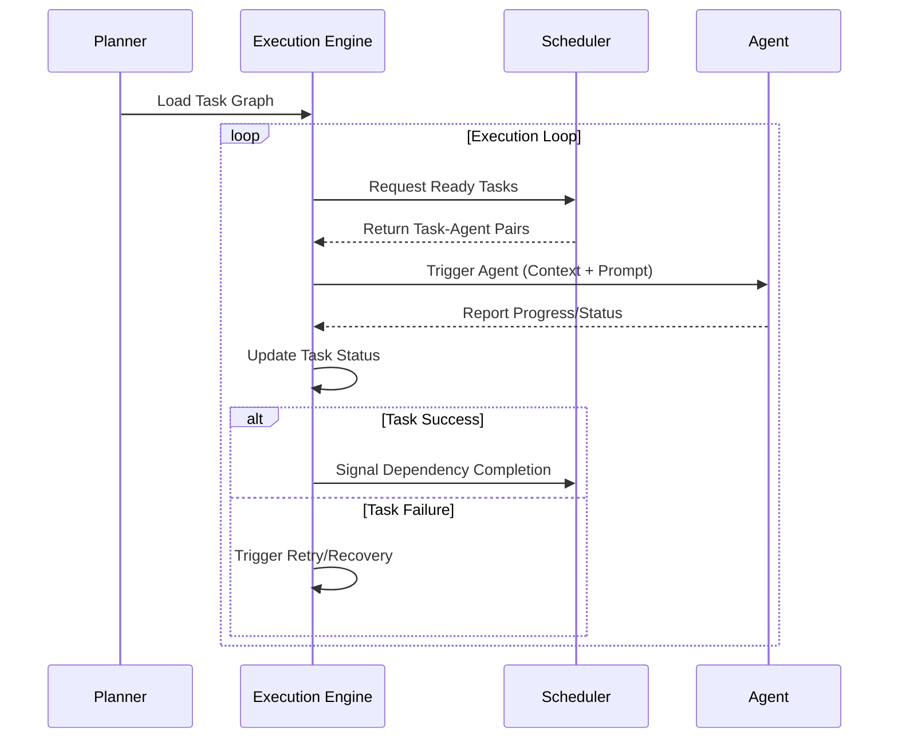

# Execution Engine

The Execution Engine is the heart of the PEN.GUIN ecosystem, responsible for orchestrating the execution of task graphs produced by the planner and managed by the scheduler. It coordinates agents, monitors progress, and ensures the system remains resilient to failures.

## Core Responsibilities

The Execution Engine manages the lifecycle of task execution through the following processes:

### 1. Task Graph Loading
When a new plan is generated, the Execution Engine loads the task graph from the `core/task-graph.md` or a JSON equivalent. It parses the dependencies and initializes the initial states of all task nodes as `pending`.

### 2. Scheduler Interaction
The engine maintains a tight loop with the `kernel/task-scheduler.md`. 
- **Query**: The engine asks the scheduler for the next set of `ready` tasks.
- **Assignment**: The scheduler returns task-agent pairings based on priority, skills, and availability.
- **Dispatch**: The engine officially hands off the task context to the assigned agent.

### 3. Agent Triggering
To trigger an agent, the Execution Engine:
1.  **Context Preparation**: Gathers all necessary inputs, file paths, and environment variables.
2.  **Instruction Injection**: Appends relevant prompts from `workspace/prompts.md` and any detected skills.
3.  **Activation**: Invokes the agent's entry point with the prepared context.

### 4. Monitoring and Status Updates
The engine continuously monitors all `running` tasks:
- **Heartbeats**: Checks for agent activity and progress updates.
- **State Updates**: Updates the task status in the graph (e.g., to `completed`, `failed`, or `blocked`) based on the agent's output.
- **Log Collection**: Aggregates logs and artifacts produced during execution for auditability.

## Advanced Execution Features

### Parallel Task Execution
The engine is designed for concurrency. It can trigger multiple independent tasks simultaneously as long as their dependencies are met and agents/resources are available. This maximizes throughput and reduces overall plan completion time.

### Failure Recovery and Retries
Resilience is built into the engine's core:
- **Retries**: If a task moves to the `failed` state due to a transient error (e.g., network timeout), the engine can automatically re-queue it for execution up to a configurable maximum number of attempts.
- **Checkpointing**: The engine persists the state of the task graph after every transition. In the event of a system crash, it can reload the last known good state and resume execution.
- **Rollback**: For critical failures that compromise system integrity, the engine can trigger predefined rollback procedures to restore the workspace to a stable state.

