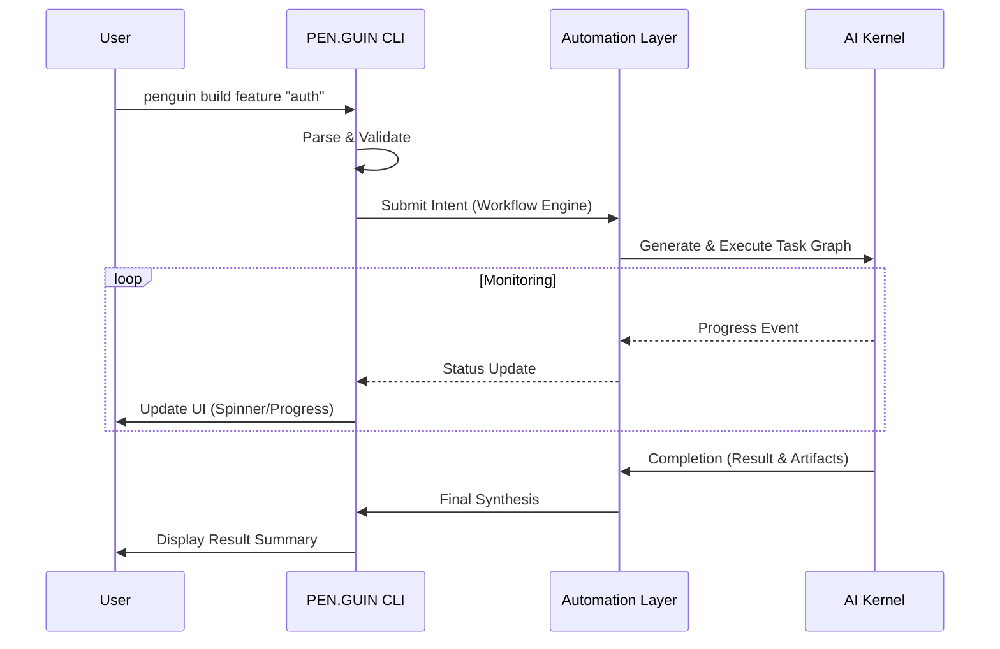

# PEN.GUIN CLI Architecture

The PEN.GUIN CLI is the primary user-facing component of the ecosystem. It provides a robust and intuitive command-line interface for developers to interact with the AI Kernel, manage tasks, and orchestrate complex development workflows.

## Core Responsibilities

The CLI acts as the entry point and the synthesis layer for all user-driven activities:

### 1. Command Parsing and Validation
When a developer executes a `penguin` command, the CLI performs several initial steps:
- **Lexical Analysis**: Breaks the command string into tokens (command, sub-commands, flags, and positional arguments).
- **Schema Validation**: Validates the command structure against the definitions in `automation/command-system.md`.
- **Environment Check**: Verifies that the current directory is a valid PEN.GUIN workspace and that necessary environment variables are set.

### 2. Task Translation (Taskification)
Once a command is validated, the CLI translates it into a machine-readable intent:
- **Intent Synthesis**: Converts the high-level user command (e.g., `build feature "login"`) into a structured JSON request.
- **Handoff to Automation**: This intent is then passed to the `Automation Layer`'s `Workflow Engine`.
- **Plan Monitoring**: For multi-task commands, the CLI transitions into a monitoring state, tracking the progress of the generated `Task Graph`.

### 3. Interaction with the Automation Layer
The CLI communicates with the `Automation Layer` via a standardized internal API or message bus:
- **Submission**: Sends the translated command to the `Workflow Engine`.
- **Event Subscription**: Subscribes to real-time events from the `Execution Engine` and `Agent Runner`.
- **Intervention Handling**: If the Kernel requires user clarification or manual approval, the CLI presents the request to the terminal and captures the user's response.

### 4. Result Presentation and Synthesis
The final stage of the CLI's lifecycle is presenting the outcome of the execution:
- **Progress Visualization**: Uses terminal-based UI elements (spinners, progress bars, or tree views) to show the state of the task graph in real-time.
- **Result Aggregation**: Fetches the final `Result File` from `workspace/results/`.
- **Terminal Synthesis**: Prints a concise, high-signal summary of the work performed, including paths to newly created artifacts and any audit/review reports.

## Command Execution Flow

## System Integration

- **Command System (`automation/command-system.md`)**: Defines the valid command set and their mappings.
- **Workflow Engine (`automation/workflow-engine.md`)**: Receives the CLI's intent and orchestrates execution.
- **Result Delivery (`automation/result-delivery.md`)**: Provides the data that the CLI formats for the user.
