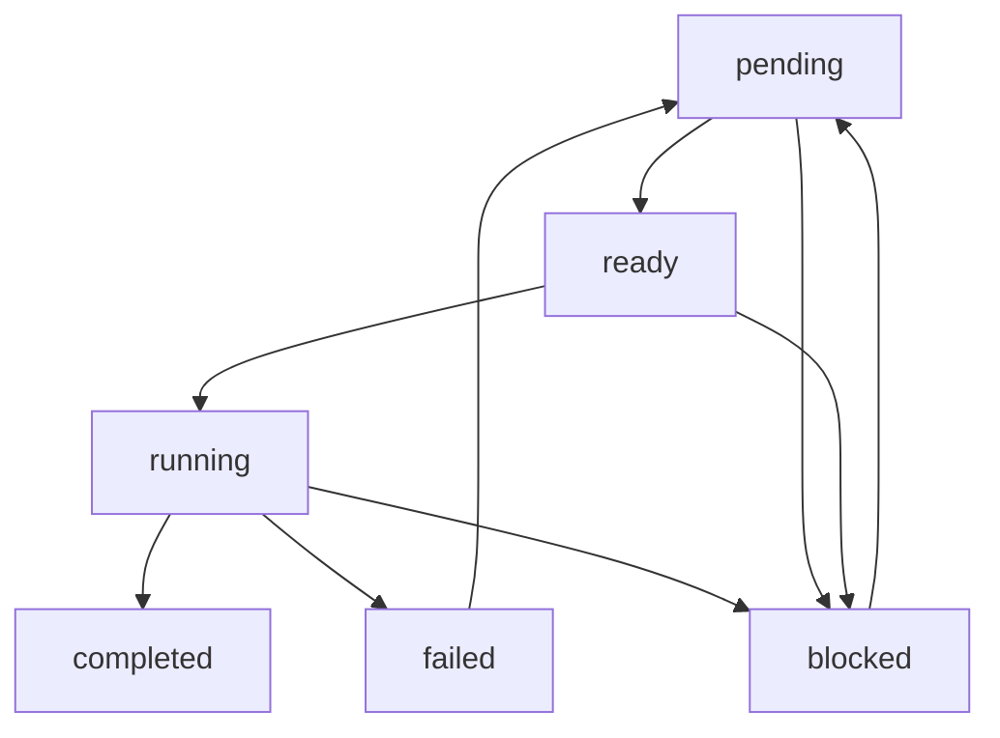

# Task Execution Lifecycle

This document defines the states and transitions for task execution within the PEN.GUIN ecosystem. The task lifecycle ensures that all operations are traceable, manageable, and resilient to failures.

## Lifecycle States

The execution engine moves tasks through the following states:

- **pending**: The initial state of a task upon creation. It remains in this state while waiting for its dependencies to be satisfied or until it is prioritized for execution.
- **ready**: A task transitions to this state once all its prerequisites and dependencies are met. It is now available to be picked up by the execution engine or an assigned agent.
- **running**: The task is currently being executed. An agent is actively working on the task, and its progress is being monitored by the kernel.
- **completed**: The task has been successfully executed, and its objectives have been met and validated.
- **failed**: The task execution was interrupted by an unrecoverable error or failed to meet its validation criteria.
- **blocked**: The task cannot proceed due to external factors, missing information, or a requirement for manual intervention from the user.

## State Transitions

The execution engine manages transitions between states based on the following logic:

1.  **Creation**: All new tasks start in the `pending` state.
2.  **Dependency Resolution**: When the kernel detects that all dependencies for a `pending` task are completed, it moves the task to `ready`.
3.  **Execution Start**: When an agent begins working on a `ready` task, the state is updated to `running`.
4.  **Success**: Upon successful completion and validation of the task's goals, the state moves from `running` to `completed`.
5.  **Failure**: If an error occurs during execution that the agent cannot resolve, or if validation fails, the task moves from `running` to `failed`.
6.  **Blocking**: A task can be moved to `blocked` from `pending`, `ready`, or `running` if a condition arises that prevents further progress (e.g., waiting for user input or an external resource).
7.  **Recovery**: A `failed` or `blocked` task may be moved back to `pending` or `ready` after the underlying issue is resolved or a retry is triggered.

