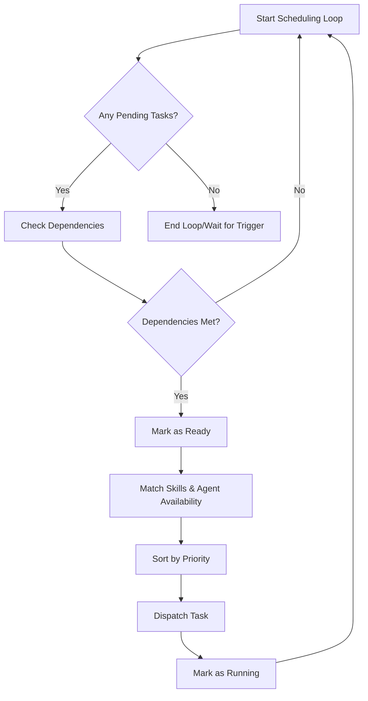

# Graph Scheduler

The Graph Scheduler is a core component of the PEN.GUIN kernel, responsible for determining the optimal execution order of tasks within the system's task graph. It ensures that tasks are executed efficiently, respecting dependencies and resource constraints.

## Decision Logic

The scheduler decides which task to execute next by evaluating several key factors:

### 1. Task Dependencies
The primary constraint for the scheduler is the dependency graph. A task is only considered for execution if all its parent tasks (dependencies) have reached the `completed` state. The scheduler performs a topological sort or traverses the directed acyclic graph (DAG) to identify "ready" tasks.

### 2. Required Skills
Each task may specify a set of required skills. The scheduler cross-references these requirements with the `skill-registry.md` and the capabilities of available agents. A task will only be dispatched to an agent that possesses the necessary skills or can acquire them through the skill integration layer.

### 3. Agent Availability
The scheduler monitors the state of all agents in the system. It will not assign a task to an agent that is already in a `running` state. It maintains a pool of available agents and balances the load across them to prevent bottlenecks.

### 4. Execution Priority
When multiple tasks are `ready` and agents are available, the scheduler uses a priority-based system to break ties. Priorities can be:
- **Critical**: System-level tasks or emergency fixes (e.g., security patches).
- **High**: Tasks on the critical path of a major milestone.
- **Medium**: Standard feature development or documentation.
- **Low**: Background optimizations or non-essential refactoring.

## Scheduling Algorithm

The scheduling loop follows these steps:

1.  **Identify Ready Tasks**: Scan the task graph for all tasks in the `pending` state whose dependencies are all `completed`. Move these to the `ready` state.
2.  **Filter by Skills**: For each `ready` task, identify the required skills.
3.  **Check Agent Pool**: Match `ready` tasks with available agents that have the corresponding skills.
4.  **Apply Priority**: If multiple `ready` tasks can be assigned to the same available agent, select the one with the highest priority.
5.  **Dispatch**: Move the selected task to the `running` state and assign it to the chosen agent.
6.  **Update Graph**: Upon task completion or failure, re-evaluate the graph to identify new `ready` tasks or handle blocked paths.

## Handling Blocked and Failed Tasks
- **Blocked**: If a high-priority task is `blocked`, the scheduler may re-prioritize other tasks to resolve the blockage (e.g., assigning an agent to provide the missing information).
- **Failed**: If a task fails, the scheduler may attempt a retry (up to a defined limit) or mark all downstream dependent tasks as `blocked` until the failure is resolved.

