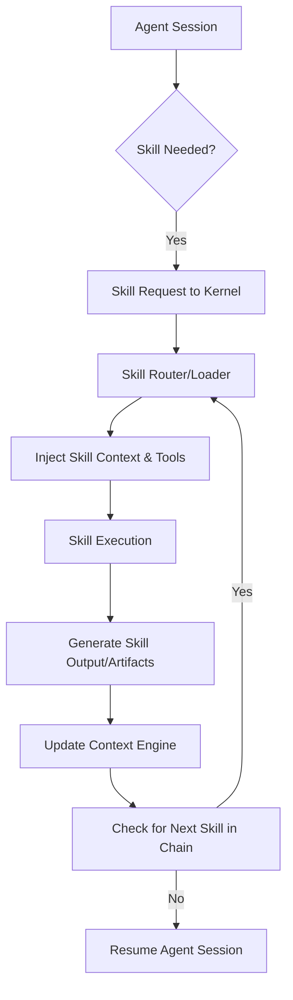

# Skill Execution Runtime

The Skill Execution Runtime is the specialized layer within the PEN.GUIN kernel that manages the lifecycle of skills during task execution. It allows agents to dynamically extend their capabilities by loading and executing modular units of specialized knowledge and tools.

## Skill Loading During Task Execution

Skills are loaded lazily to minimize initial overhead and ensure that only the necessary capabilities are active within an agent's context.

1.  **Detection**: The `Skill Detection` module analyzes the current task and identifies potential skill requirements.
2.  **Activation**: When the agent or the kernel determines a skill is needed, the `Skill Runtime` invokes the `tools/skill-loader.md`.
3.  **Context Injection**: The skill's instructions (from its `SKILL.md`) and any associated configuration are injected into the agent's active session.
4.  **Tool Availability**: Any tools or libraries required by the skill are verified and made available to the agent's execution sandbox.

## Agent Skill Requests

Agents can explicitly request skills from the kernel if they encounter a sub-task that falls outside their core persona's expertise.

- **Request Protocol**: The agent uses a standardized request format within its CLI output to signal the kernel.
- **Kernel Evaluation**: The kernel's `Skill Router` receives the request, identifies the most appropriate skill in the `Skill Registry`, and triggers the loading process.
- **Dynamic Adaptation**: Once the skill is loaded, the agent's instructions are updated to reflect the new capabilities, allowing it to proceed with the specialized task.

## Skill Output and Data Flow

The `Skill Runtime` ensures that the results of a skill's execution are structured and passed correctly between the agent, the skill itself, and the broader system.

- **Standardized Formats**: Skills are encouraged to produce outputs in machine-readable formats (e.g., JSON) to facilitate downstream processing.
- **Artifact Generation**: Any tangible results (e.g., generated code, transformed data, or reports) are saved as artifacts in the `workspace/artifacts/` directory.
- **Context Updates**: The `Context Engine` updates the task's context with the skill's findings, making them available to subsequent tasks in the graph.

## Skill Chaining

The PEN.GUIN architecture supports complex workflows where the output of one skill serves as the input to another, creating a "skill chain."

1.  **Chaining Logic**: Defined in `skills/skill-chaining.md`, this logic allows for sequential or parallel execution of interdependent skills.
2.  **Intermediate Handover**: The `Skill Runtime` manages the handover of data between skills in the chain, ensuring compatibility and data integrity.
3.  **Higher-Level Abstractions**: Chaining allows for the creation of "super-skills" that combine simpler components to solve complex architectural or engineering challenges.

