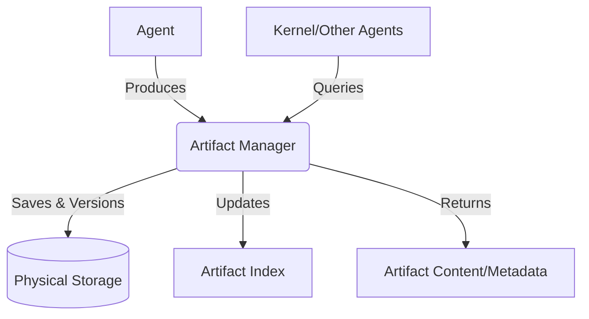

# Artifact Manager

The Artifact Manager is the specialized component within the PEN.GUIN ecosystem responsible for the lifecycle management of all digital assets produced by AI agents. It provides a standardized interface for storing, versioning, and retrieving artifacts, ensuring that every piece of data generated during a task is accounted for and accessible.

## Core Responsibilities

The Artifact Manager handles the following key functions:

### 1. Unified Storage
All artifacts are stored in a structured manner within the `workspace/artifacts/` directory. The manager abstracts the underlying storage details, allowing agents and the kernel to interact with artifacts through a consistent API.

- **Source Code:** Finalized or intermediate code snippets, full files, and diffs.
- **Documentation:** Markdown files, API specs, and architectural diagrams.
- **Execution Plans:** Task graphs and scheduling metadata generated by the planner.
- **Analysis Results:** Research findings, dependency maps, and security audit reports.
- **Logs:** Verbose execution traces, agent reasoning logs, and build/test outputs.

### 2. Versioning Strategy
To ensure traceability and facilitate rollbacks, the Artifact Manager employs a robust versioning system:

- **Content-Addressable Storage (CAS):** Artifacts can be indexed by a cryptographic hash (e.g., SHA-256) of their content. This prevents duplication and ensures data integrity.
- **Incremental Versioning:** When an agent modifies an existing artifact (e.g., refining a piece of code), the manager creates a new version while preserving the previous state.
- **Metadata Linking:** Each version is linked to its parent task ID, session ID, and the authoring agent's identity.

### 3. Retrieval and Discovery
The manager provides several ways to locate and access artifacts:

- **By Unique ID:** Every artifact is assigned a UUID upon creation for direct access.
- **By Task/Session:** The kernel can retrieve all artifacts associated with a specific task or an entire execution session.
- **By Type and Tag:** Artifacts can be filtered by their category (e.g., `code`, `log`) or custom tags assigned by agents (e.g., `high-priority`, `deprecated`).
- **Searchable Index:** A centralized index (e.g., `artifact-index.json`) is maintained to allow for rapid querying of artifact metadata.

## Workflow Integration

1.  **Generation:** An agent completes a task and produces an output.
2.  **Registration:** The agent (or the Agent Runner) sends the output to the Artifact Manager.
3.  **Persistence:** The manager saves the file, generates a version ID, and updates the index with relevant metadata.
4.  **Notification:** The manager signals the Execution Engine that a new artifact is available, which may trigger downstream tasks or reviews.
5.  **Consumption:** Subsequent agents or the user can request the artifact from the manager using its ID or metadata filters.

