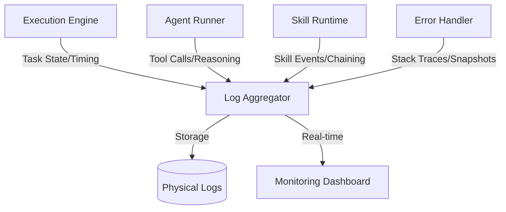

# Execution Logs

The PEN.GUIN logging system provides a comprehensive and granular record of all activities within the ecosystem. It is designed for observability, debugging, and auditability, ensuring that every decision and action taken by the kernel, agents, and skills is transparent.

## Logging Architecture

Logs are generated across different layers of the system and aggregated for analysis.

### 1. Task Execution Logs
The `Execution Engine` and `Graph Scheduler` generate high-level logs that track the overall progress of a plan.
- **State Transitions**: Records every time a task moves between states (e.g., `pending` -> `ready` -> `running`).
- **Dependency Resolution**: Logs the satisfaction of task prerequisites.
- **Timing Data**: Captures start and end times for each task to identify bottlenecks.
- **Dispatch Events**: Records which agent was assigned to which task and why.

### 2. Agent Run Logs
The `Agent Runner` captures detailed logs from individual agent sessions.
- **Initialization**: Records the agent's startup configuration and the prompts injected.
- **Reasoning Loop**: Captures the agent's step-by-step internal reasoning (if exposed) and its decision-making process.
- **Tool Calls**: Logs every tool invocation, including the arguments passed and the results returned.
- **Inter-Agent Communication**: Records any handoffs or signals sent to other agents via the kernel.
- **Output Synthesis**: Captures the final response and artifacts generated by the agent.

### 3. Skill Execution Logs
The `Skill Execution Runtime` logs specialized activities related to skill usage.
- **Skill Loading**: Records when a skill is detected, loaded, and initialized.
- **Runtime Performance**: Monitors the execution time and resource usage of specific skills.
- **Chaining Events**: Logs the transfer of data between skills in a chain.
- **Skill-Specific Errors**: Captures detailed diagnostics for failures within a skill's logic.

### 4. Error and Exception Logs
Error logging is prioritized to facilitate rapid recovery and root-cause analysis.
- **Error Stack Traces**: Full traces for system-level exceptions or agent-level failures.
- **Contextual Snapshots**: When an error occurs, the system logs a snapshot of the current workspace state and task context.
- **Retry Attempts**: Records the failure details and the subsequent retry logic applied by the Execution Engine.
- **Rollback Records**: Logs any automated or manual rollback operations performed in response to a critical error.

## Storage and Format

- **Structured Logging**: Logs are primarily generated in JSON format to enable easy parsing by automated tools and the `Learning Engine`.
- **Directory Structure**: Logs are stored within the `workspace/artifacts/` or a dedicated `workspace/logs/` directory, often partitioned by `session_id` and `run_id`.
- **Retention Policy**: High-level logs are preserved for long-term auditability, while verbose agent/skill logs may be rotated or archived based on workspace configuration.

